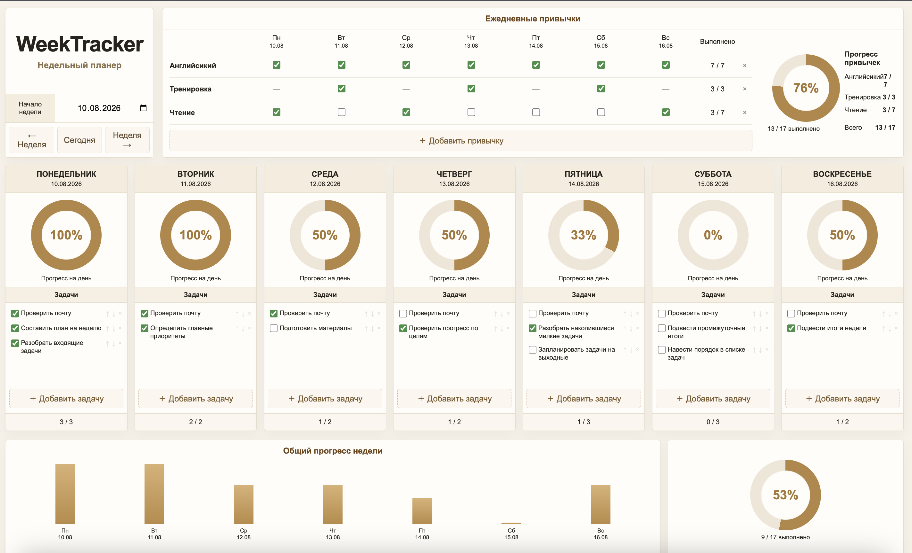
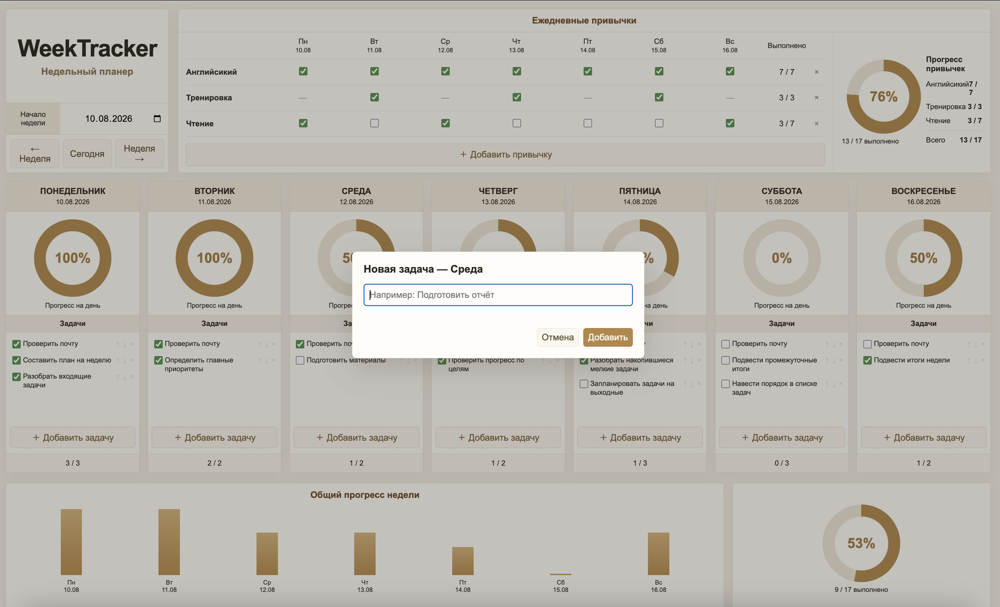
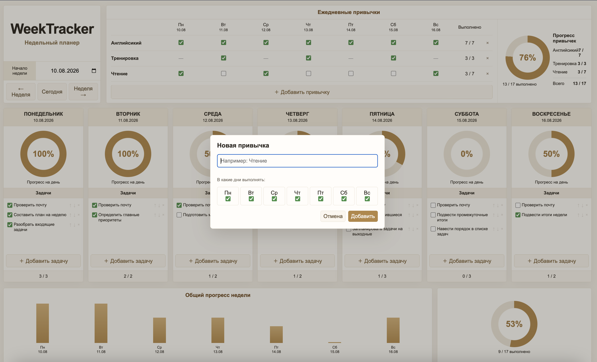
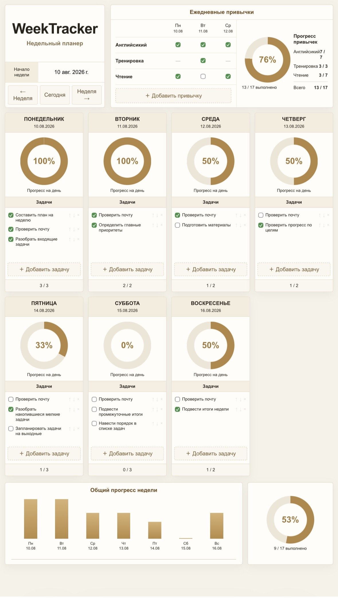

# 📅 WeekTracker

Недельный планировщик и трекер привычек в вашей Google Таблице.

[](https://github.com/SGKonstantin/WeekTracker/actions/workflows/ci.yml)
[](LICENSE)

[English version](README.en.md)

WeekTracker объединяет недельный план, задачи, привычки и прогресс в Google Apps Script Web App. Отдельный сервер не нужен: приложение и данные находятся в собственной копии Google Sheets пользователя.

### [🚀 Создать свою копию WeekTracker](https://docs.google.com/spreadsheets/d/%317T7ZwIzmjOS9dhjkvPIkf44EyPINVzOCXXwXz6E1wIs/copy)

### [📖 Инструкция по установке](docs/INSTALLATION.md)

## ✨ Возможности

| | Возможность | Что доступно |
|---|---|---|
| 📅 | Неделя | Планирование с понедельника по воскресенье и навигация между неделями |
| ✅ | Задачи | Добавление, редактирование, выполнение, soft delete и порядок внутри дня |
| 🔁 | Привычки | Семидневное расписание, отметки выполнения и защита от дубликатов |
| 📊 | Прогресс | Дневные и недельные показатели задач и привычек |
| 🔐 | Собственные данные | Хранение в личной копии Google Таблицы |
| 🌐 | Web App | Адаптивный интерфейс в браузере на компьютере и телефоне |

Задачи можно менять местами только внутри одного дня. Перенос между днями пока не поддерживается.

## 📸 Интерфейс



<p align="center">
  
  
</p>

### На мобильном устройстве

WeekTracker открывается в мобильном браузере и не является отдельным нативным приложением.

<p align="center">
  
</p>

### Видео

> Короткая видеодемонстрация будет добавлена позже.

## 🚀 Быстрый старт

1. [Создайте личную копию WeekTracker](https://docs.google.com/spreadsheets/d/%317T7ZwIzmjOS9dhjkvPIkf44EyPINVzOCXXwXz6E1wIs/copy).
2. Выполните **WeekTracker → Первоначальная настройка**.
3. Разверните Apps Script как Web App.
4. Один раз откройте полученный Web App URL.
5. В дальнейшем используйте **WeekTracker → Открыть приложение** в своей таблице.

Полный путь со скриншотами: [подробная инструкция по установке](docs/INSTALLATION.md).

## 🔐 Данные и приватность

Задачи, привычки и настройки хранятся в собственной Google Sheet copy пользователя. Исходный шаблон не получает данные созданной копии.

Подробнее: [данные и приватность](docs/DATA_AND_PRIVACY.md).

## 🧪 Качество

```sh
npm run check
```

Команда проверяет синтаксис production source, запускает Vitest и выполняет project safety/privacy checks. Те же проверки автоматически запускаются в GitHub Actions для pull requests и push в `main`.

## 🛠 Разработка

Production source находится в `src/`. Локальная разработка и standalone/clasp workflow описаны в [руководстве разработчика](docs/DEVELOPMENT.md).

## 🤝 Участие

Правила участия: [.github/CONTRIBUTING.md](.github/CONTRIBUTING.md).

Для предложений и сообщений об ошибках используйте [GitHub Issues](https://github.com/SGKonstantin/WeekTracker/issues). Не публикуйте приватные ID, токены или персональные данные.

## 💬 Поддержка

Информация о помощи и обратной связи: [docs/SUPPORT.md](docs/SUPPORT.md).

## 📄 Лицензия

WeekTracker распространяется по [лицензии MIT](LICENSE).
