# Установка WeekTracker

WeekTracker работает внутри вашей собственной копии Google Таблицы. При установке вы получаете:

- собственную Google Таблицу;
- собственную копию Apps Script;
- собственное Web App;
- собственное хранилище задач, привычек и настроек.

Данные одной копии WeekTracker не используются другой копией.

> Установка выполняется один раз. После неё работать с редактором Apps Script больше не нужно.

## Создание своей копии

### Шаг 1. Создайте свою копию WeekTracker

[Создать свою копию WeekTracker](https://docs.google.com/spreadsheets/d/%317T7ZwIzmjOS9dhjkvPIkf44EyPINVzOCXXwXz6E1wIs/copy)

Рекомендуемый способ:

1. Нажмите ссылку **«Создать свою копию WeekTracker»** выше.
2. На странице **«Копия документа»** нажмите **«Создать копию»**.

Кнопка **«Просмотреть файл Apps Script»** для установки не требуется. Google сообщает, что вместе с документом будет создана копия прикреплённого Apps Script — это ожидаемо.

Если вы уже открыли исходный WeekTracker Template, можно использовать альтернативный путь: выберите **Файл → Создать копию**, укажите удобное название и нажмите **«Создать копию»**.

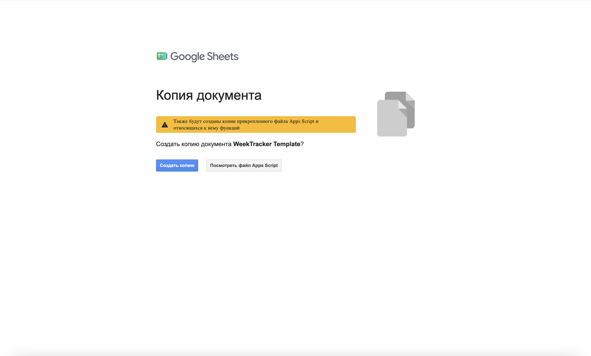

### Шаг 2. Выполните первоначальную настройку

В созданной копии откройте **WeekTracker → Первоначальная настройка**.

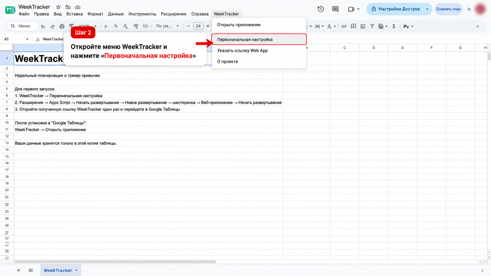

### Шаг 3. Разрешите запуск скрипта

При первом запуске Google покажет сообщение **«Требуется авторизация»**. Нажмите **OK**.

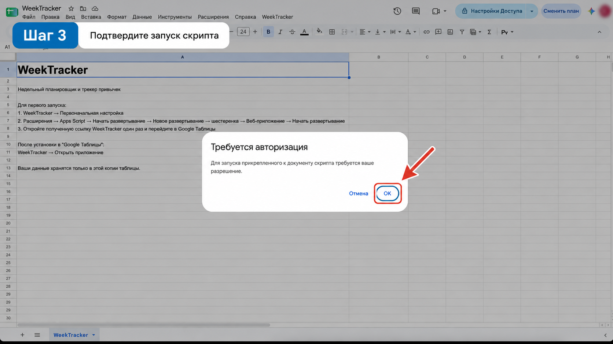

Разрешение необходимо вашей собственной копии скрипта, чтобы работать с вашей Google Таблицей.

### Шаги 4–5. Продолжите авторизацию

Google может показать предупреждение **«Эксперты Google не проверяли это приложение»**. Такое окно ожидаемо для пользовательской копии Apps Script, которая не опубликована как приложение Google Marketplace.

1. Нажмите **«Дополнительные настройки»**.
2. Нажмите **«Перейти на страницу "WeekTracker" (небезопасно)»**.

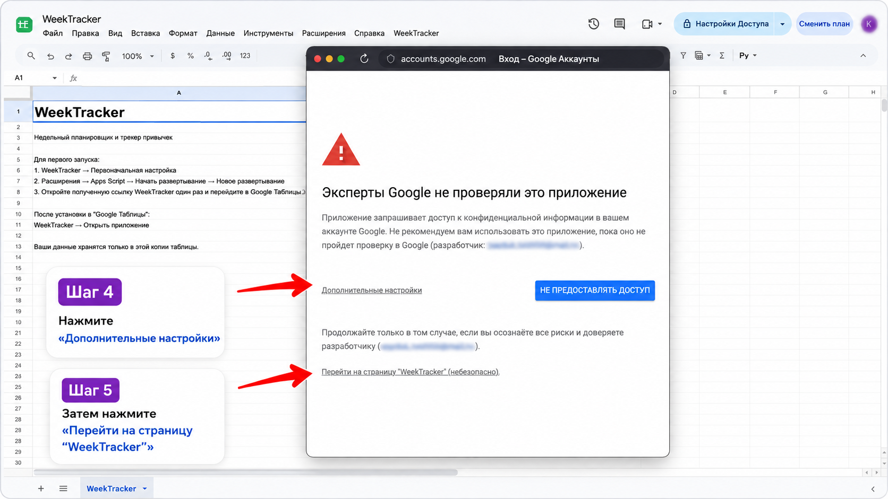

Перед предоставлением доступа вы можете просмотреть запрашиваемые разрешения.

### Шаги 6–7. Проверьте разрешения

Просмотрите список разрешений, прокрутите окно вниз и нажмите **«Продолжить»**.

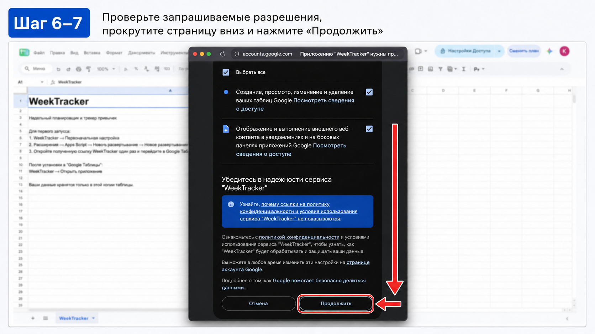

После успешной первоначальной настройки Google может показать сообщение о её завершении.

## Развёртывание Web App

### Шаг 8. Откройте Apps Script

В Google Таблице выберите **Расширения → Apps Script**.

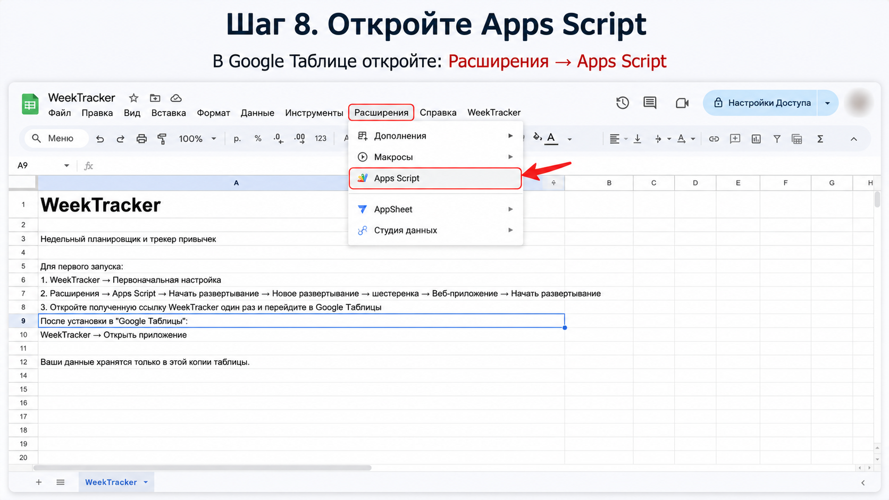

### Шаг 9. Создайте новое развёртывание

1. Нажмите **«Начать развёртывание»**.
2. Выберите **«Новое развёртывание»**.

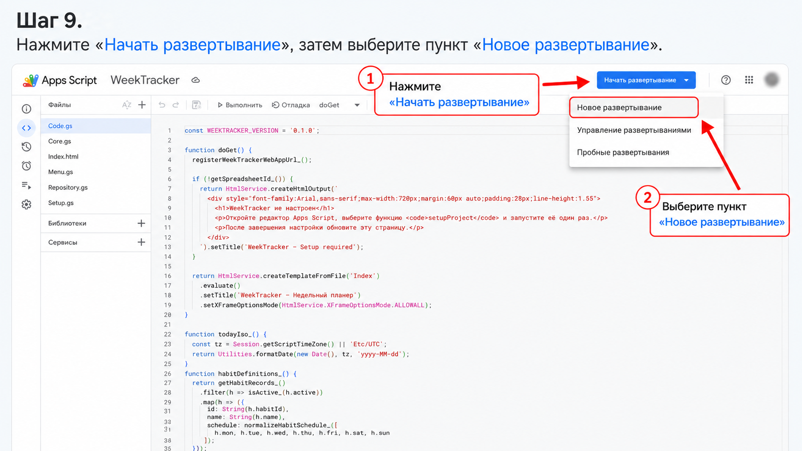

### Шаг 10. Выберите Web App

В окне **«Новое развёртывание»** нажмите значок шестерёнки и выберите **«Веб-приложение»**.

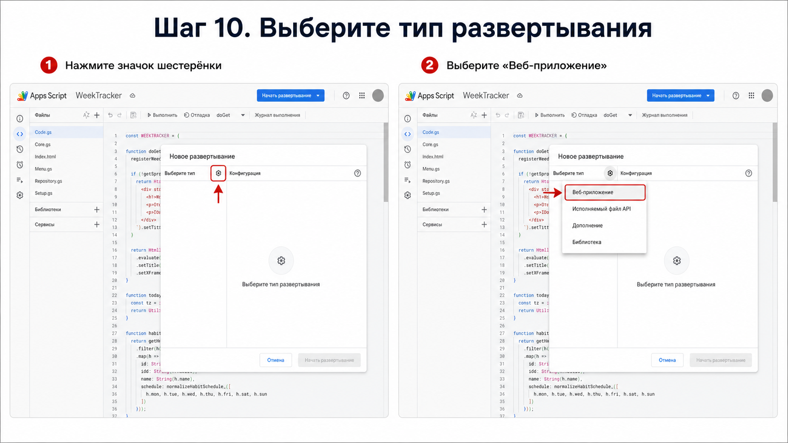

### Шаг 11. Настройте Web App

Укажите параметры:

- **Описание:** WeekTracker
- **Запуск от имени:** От моего имени
- **У кого есть доступ:** Только у меня

Затем нажмите **«Начать развёртывание»**.

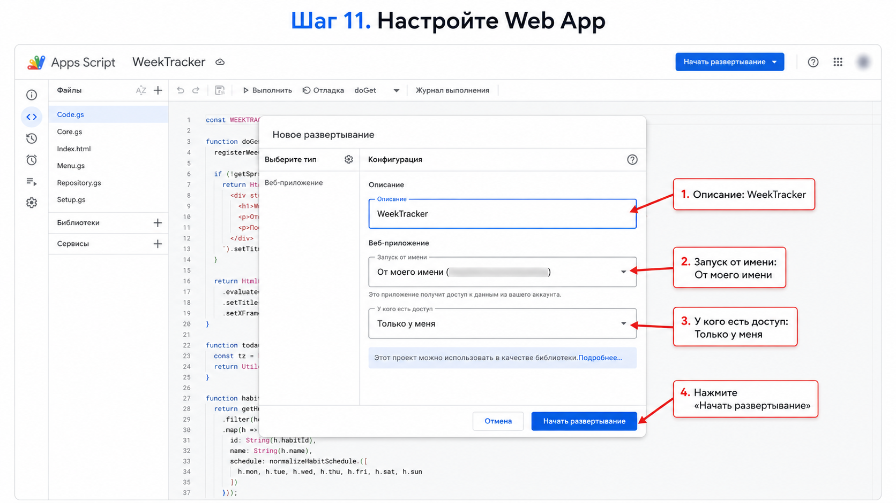

Если Google снова запросит авторизацию во время развёртывания, это нормально. Следуйте тем же шагам подтверждения доступа.

## Первый запуск

### Шаг 12. Откройте Web App первый раз

После развёртывания Google покажет Web App URL. Нажмите саму ссылку и один раз откройте WeekTracker.

При первом открытии WeekTracker автоматически регистрирует правильный Web App URL для меню Google Таблицы. Вам не нужно копировать URL в отдельный файл, запоминать его или сохранять deployment ID.

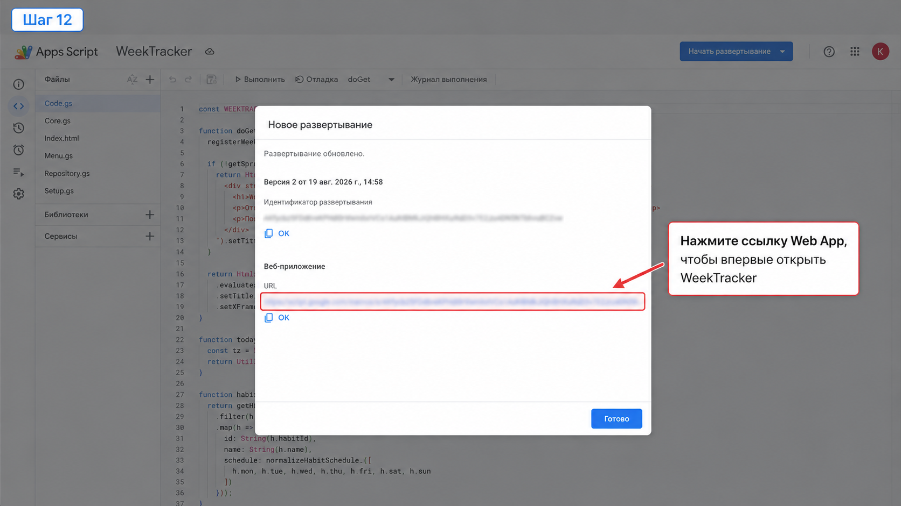

### Шаг 13. Вернитесь в Google Таблицу

Вернитесь в свою Google Таблицу и выберите **WeekTracker → Открыть приложение**.

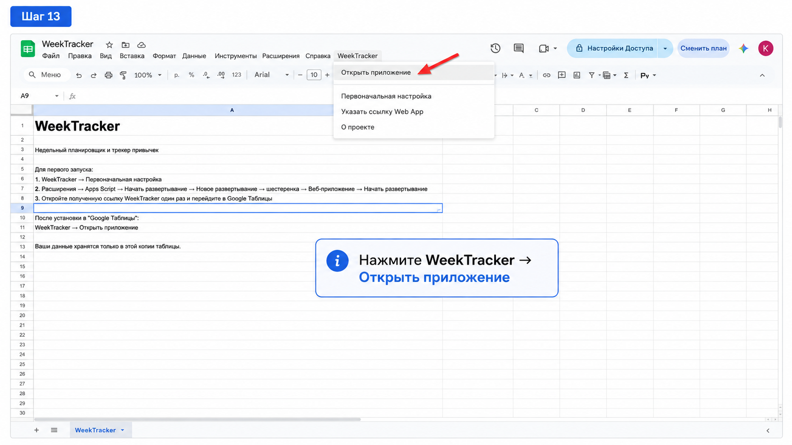

### Шаг 14. Откройте WeekTracker

В окне **«WeekTracker готов»** нажмите **«Открыть WeekTracker»**.

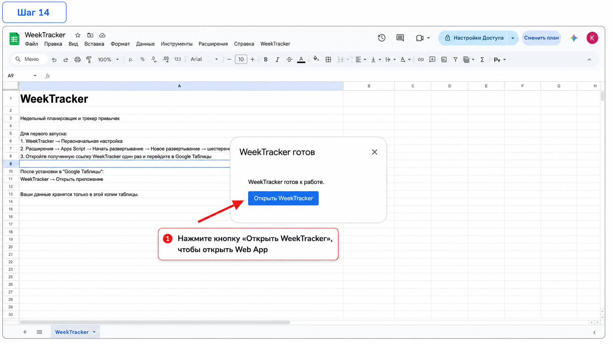

Готово. Установка завершена.

## Как открывать WeekTracker потом

Основной способ:

**Google Drive → ваша таблица WeekTracker → WeekTracker → Открыть приложение → Открыть WeekTracker**

Ссылку Web App запоминать не нужно.

### Быстрый доступ на компьютере

Открытую страницу WeekTracker можно добавить в закладки браузера.

### Быстрый доступ на телефоне

WeekTracker можно открыть в мобильном браузере и через меню браузера добавить страницу на главный экран. WeekTracker остаётся Web App, а не отдельным мобильным приложением.

### Если ссылка перестала открываться

Сначала выберите **WeekTracker → Открыть приложение**.

Если ссылка не зарегистрирована или была изменена, выберите **WeekTracker → Указать ссылку Web App** и вставьте действующий URL с окончанием `/exec` из окна развёртывания Apps Script.

Дополнительные решения собраны в разделе [«Решение проблем»](TROUBLESHOOTING.md).

## Данные и приватность

- Задачи, привычки и настройки хранятся в системных листах вашей собственной копии Google Таблицы.
- Не удаляйте Google Таблицу WeekTracker, если хотите сохранить данные.
- Исходный WeekTracker Template не получает данные вашей копии.

Подробнее: [данные и приватность](DATA_AND_PRIVACY.md).
